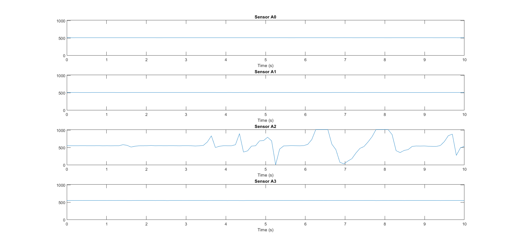

# PEEPS-Software
Repository containing the MATLAB code required for the pressure measuring Arduino board.

## Theory of Operation
* The user enters the desired duration of data recording.
* This MATLAB LiveScript will process serial data packets every 10 ms, or at a sampling frequency of 100Hz.
* The packets contain data sampled straight from a 12-bit analog to digital converter (ADC) and are therefore in a range of 0-4095.
* This range corresponds to an analog voltage range of 0-3.3VDC, such that 2048 would indicate a reading of 1.65 volts.
* **To Do:** A transfer function translates the raw ADC values into pressure, based on the datasheets of the [MPXV7002 sensor](https://www.nxp.com/docs/en/data-sheet/MPXV7002.pdf)
* MATLAB will then plot the pressure over the capture duration for each sensor.

## Interface
This code reads the comma-separated data packets from a serial port, configured at 115200 bps.

## Screenshot
Pressure data plotted over 10 seconds while user squeezed an eyedropper over sensor A2.

## Prerequisites
|**Item**|**Description**|
|--------|---------------|
|[MATLAB 2019b](https://www.mathworks.com/help/matlab/index.html?s_tid=CRUX_lftnav)|MATLAB is a computational data analysis software tool|

---
*Last updated 2021-04-20*
